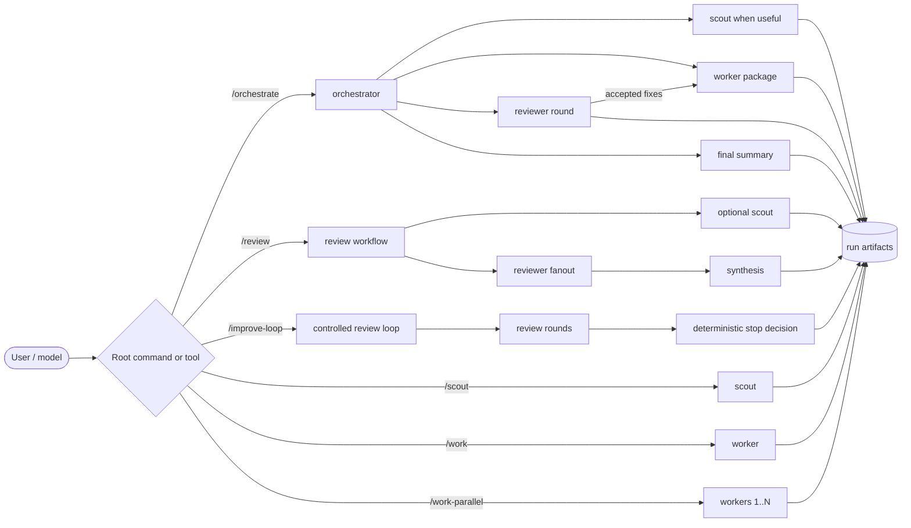
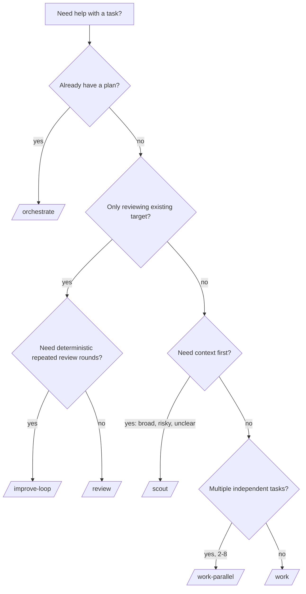
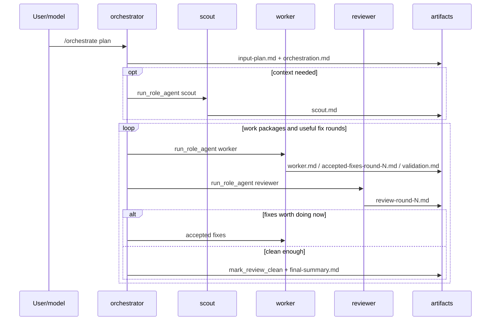
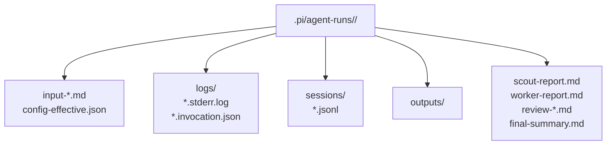

# Pi Simple Subagents

Small, opinionated Pi extension for running work through lightweight subagents.

Instead of one long agent doing everything, this extension makes the workflow visible:

- **orchestrator** plans and delegates
- **scout** gathers context and writes compact handoffs
- **worker** implements, fixes, or validates
- **reviewer** inspects existing work and reports actionable findings

> Pi remains YOLO by default: roles guide behavior and preserve artifacts, but they are not a hard sandbox.

## At a glance



| Command | Tool | Best for |
| --- | --- | --- |
| `/orchestrate <plan-or-@file>` | `run_orchestrator` | Plan-driven work with scout → worker → review/fix loops. |
| `/scout <task-or-@target>` | `run_scout` | Context gathering before risky, broad, or ambiguous work. |
| `/work <task-or-@file>` | `run_worker` | One focused implementation, fix, or validation task. |
| `/work-parallel <json>` | `run_workers_parallel` | 2-8 independent worker tasks. |
| `/review [options] <target> [focus]` | `run_reviewers` | One review-only fanout for an existing file, directory, or diff. |
| `/improve-loop [options] <target> [focus]` | `run_improve_loop` | Deterministic review-only improvement loop with structured findings and early stop. |

## Quickstart

### 1. Validate a local checkout

```bash
npm ci
npm run check
```

### 2. Install into Pi

```bash
pi install /absolute/path/to/pi-simple-subagents
mkdir -p .pi/pi-simple-subagents
cp /absolute/path/to/pi-simple-subagents/examples/config.json .pi/pi-simple-subagents/config.json
```

Reload Pi after install or config changes:

```text
/reload
```

### 3. Smoke-test the extension

```text
/scout Summarize the repository layout and write a compact scout report
```

Pi should report a run directory under `.pi/agent-runs/<run-id>/`.

## Install options

Requirements:

- Node.js `>=22.19.0`
- Pi `@earendil-works/pi-coding-agent` `0.78.x` or compatible newer `0.x` version

Local development install:

```bash
pi install /absolute/path/to/pi-simple-subagents
# or, from the repository parent:
pi install ./pi-simple-subagents
```

Git install after publishing:

```bash
# reproducible tag / commit preferred
pi install git:https://github.com/SkipXS/pi-simple-subagents#v0.1.0
pi install git:https://github.com/SkipXS/pi-simple-subagents#<commit-sha>

# moving default branch for quick testing
pi install git:https://github.com/SkipXS/pi-simple-subagents
```

## Which workflow should I use?



### Common examples

```text
/orchestrate @docs/plan.md
/scout Map parser behavior, affected files, risks, and next steps
/work Fix the failing parser test and run the focused test suite
/review --reviewer "runtime correctness" --reviewer "packaging UX" @extensions/pi-simple-subagents
/improve-loop --max-rounds 3 --min-severity high --reviewer "runtime correctness" @extensions/pi-simple-subagents
```

Parallel workers accept JSON only:

```text
/work-parallel ["Update README usage examples","Add parser regression tests"]
/work-parallel [{"name":"docs","task":"Update README usage examples"},{"name":"tests","task":"Add parser regression tests"}]
```

`/improve-loop` is review-only: it never runs worker auto-fixes. Defaults are `maxRounds=5`, `minSeverity=medium`, `autoFix=false`, evidence-required reviewer synthesis, and early stop on clean review, optional-only/non-actionable findings, repeated/no-progress findings, review failure, or the max-round cap. Evidence-less blocker/high/medium findings are preserved but do not count as actionable for continuation/repetition decisions. It writes `improve-loop.md`, `review-loop-round-N.md`, and `findings-round-N.json`.

See [Command reference](docs/reference.md#command-reference) for full slash-command options.

## How orchestration works



The orchestrator is prompted to split large milestones into small worker packages. A worker handoff should contain one deliverable, likely files, acceptance criteria, non-goals, and validation.

## Run artifacts

Every run writes durable audit artifacts. Keep `.pi/agent-runs` ignored/private because it can contain prompts, referenced file content, transcripts, and command output.



Typical layouts:

```text
# orchestration
.pi/agent-runs/<run-id>/
  input-plan.md
  orchestration-state.json
  orchestration.md
  scout.md
  worker.md
  review-round-N.md
  accepted-fixes-round-N.md
  validation.md
  final-summary.md
  logs/ outputs/ prompts/ sessions/ tasks/ delegations/

# standalone scout / worker
.pi/agent-runs/<run-id>/
  input-scout-task.md | input-worker-task.md
  scout-report.md     | worker-report.md
  logs/ outputs/ prompts/ sessions/ tasks/

# review target
.pi/agent-runs/<run-id>/
  input-target.md
  extra-review-context.md     # when --context is used
  scout-review-context.md     # when scout is enabled
  review-*.md
  final-summary.md
  review-failure-summary.md   # only on fanout failure
  logs/ outputs/ prompts/ sessions/ tasks/

# improve loop
.pi/agent-runs/<run-id>/
  input-target.md
  improve-loop.md
  review-loop-round-N.md
  findings-round-N.json
  logs/ outputs/ prompts/ sessions/ tasks/
  # each round also has a nested review run dir with review-*.md/final-summary.md
```

More details: [Run artifacts](docs/reference.md#run-artifacts).

## Configuration

Project config:

```text
.pi/pi-simple-subagents/config.json
```

Global defaults:

```text
~/.pi/agent/pi-simple-subagents/config.json
```

Project config overrides global config, except `children.piCliPath` is allowed only in global config or `PI_SIMPLE_SUBAGENTS_PI_CLI` because it selects an executable.

```json
{
  "roles": {
    "orchestrator": { "model": "openai-codex/gpt-5.5", "thinking": "medium" },
    "scout": { "model": "openai-codex/gpt-5.3-codex-spark", "thinking": "medium" },
    "worker": { "model": "openai-codex/gpt-5.5", "thinking": "medium" },
    "reviewer": { "model": "openai-codex/gpt-5.5", "thinking": "low" },
    "synthesis": { "model": "openai-codex/gpt-5.5", "thinking": "medium" }
  },
  "children": {
    "forwardCurrentExtension": "auto",
    "timeoutMs": 1800000,
    "maxConcurrentSubagents": 8
  },
  "orchestration": { "maxWorkerTaskBytes": 16384 },
  "references": {
    "maxFileBytes": 1048576,
    "allowOutsideCwd": false,
    "allowBinary": false
  },
  "artifacts": { "baseDir": ".pi/agent-runs" }
}
```

Full table: [Configuration reference](docs/reference.md#configuration-reference).

## Development

```bash
npm ci
npm run typecheck
npm test
npm run check
npm run release:check
npm pack --dry-run
```

Temporary local Pi testing:

```bash
pi install /absolute/path/to/pi-simple-subagents
# or for one-off extension loading:
pi -e /absolute/path/to/pi-simple-subagents/extensions/pi-simple-subagents/index.ts
```

Source layout:

```text
extensions/pi-simple-subagents/
  index.ts          # extension entrypoint, tools, slash commands
  workflows.ts      # orchestration/review/worker/scout flows
  child-runner.ts   # child Pi process handling
  config.ts         # config loading and validation
  artifacts.ts      # run artifact safety and writes
  references.ts     # @file/@directory reference loading
  roles.ts          # role definitions
  schemas.ts        # tool schemas
  prompts.ts        # role prompts
  state.ts          # orchestration state
  text.ts           # text helpers
```

## More documentation

- [Command reference](docs/reference.md#command-reference)
- [Tool and role details](docs/reference.md#tool-and-role-details)
- [Operational guardrails](docs/reference.md#operational-guardrails)
- [Troubleshooting](docs/reference.md#troubleshooting)
- [Cleanup and retention](docs/reference.md#cleanup-and-retention)
- [Status display](docs/reference.md#status-display)
