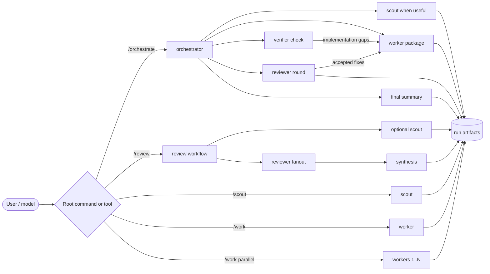
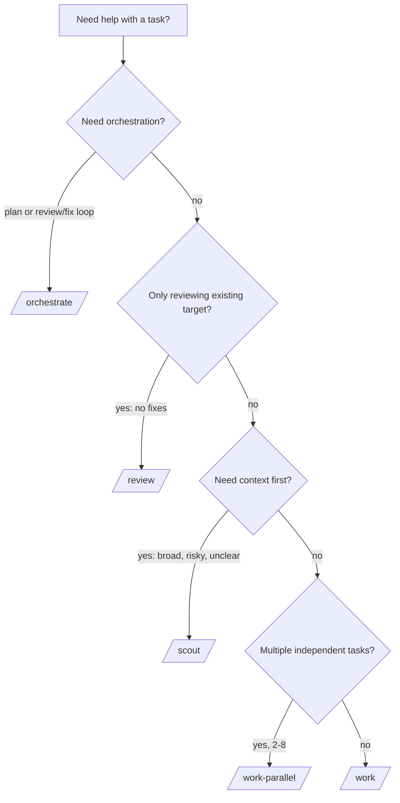
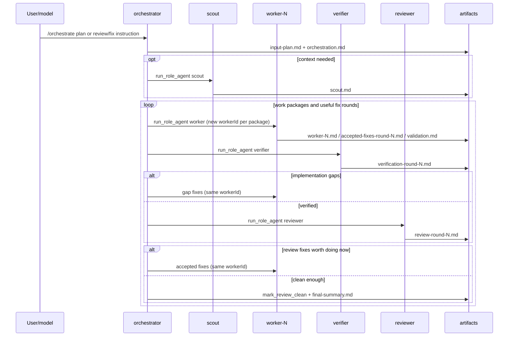
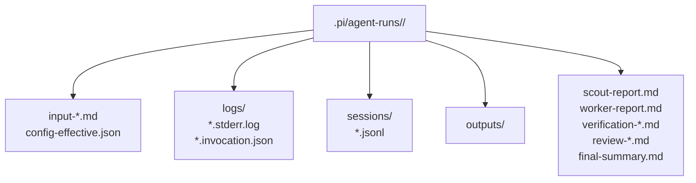

# Pi Simple Subagents

Small, opinionated Pi extension for running work through lightweight subagents.

Instead of one long agent doing everything, this extension makes the workflow visible:

- **orchestrator** plans and delegates
- **scout** gathers context and writes compact handoffs
- **worker** implements, fixes, or validates
- **verifier** checks a worker package against its plan before review
- **reviewer** inspects existing work and reports actionable findings

> Pi remains YOLO by default: roles guide behavior and preserve artifacts, but they are not a hard sandbox.

## Safety model: review-only is cooperative

`/review`, scout, verifier, reviewer, and synthesis roles are intentionally **not** implemented as a hard read-only sandbox. They are prompted to keep verification/review workflows inspection-only and to write handoff artifacts via `write_run_artifact`, but the extension does not block the normal Pi tool surface. This keeps diagnostics, tests, benchmarks, and repository-specific workflows available to verifiers and reviewers.

Child Pi processes also inherit the parent process environment by design. That preserves normal Pi/model authentication and developer tooling behavior, but it means environment variables such as API keys, cloud credentials, GitHub tokens, and CI secrets are available to child agents. Pi subscription/OAuth credentials and API keys stored in `~/.pi/agent/auth.json` remain available as long as the child runs as the same user with the same home/config directory.

Environment filtering alone would only reduce accidental forwarding of environment variables; it would not be a security boundary in YOLO mode because child agents can still use the normal tool surface and same-user files. For untrusted targets or commands, run Pi inside an external sandbox/container, separate OS user, or isolated home directory with only the credentials you intend to expose.

## At a glance



| Command | Tool | Best for |
| --- | --- | --- |
| `/orchestrate <plan-or-review/fix-instruction>` | `run_orchestrator` | Plan-driven work or worker → verifier → reviewer → accepted-fix loops. |
| `/scout <task-or-@target>` | `run_scout` | Context gathering before risky, broad, or ambiguous work. |
| `/work <task-or-@file>` | `run_worker` | One focused implementation, fix, or validation task. |
| `/work-parallel <json>` | `run_workers_parallel` | 2-8 independent worker tasks. |
| `/review [options] <target> [focus]` | `run_reviewers` | One review-only fanout for an existing file, directory, or diff. |

## Quickstart

### 1. Validate a local checkout

```bash
npm ci
npm run check
```

### 2. Install into Pi

Unix shells:

```bash
pi install /absolute/path/to/pi-simple-subagents
mkdir -p .pi/pi-simple-subagents
cp /absolute/path/to/pi-simple-subagents/examples/config.json .pi/pi-simple-subagents/config.json
```

PowerShell:

```powershell
pi install C:\absolute\path\to\pi-simple-subagents
New-Item -ItemType Directory -Force .pi/pi-simple-subagents
Copy-Item C:\absolute\path\to\pi-simple-subagents\examples\config.json .pi/pi-simple-subagents/config.json
```

Reload Pi after install or config changes:

```text
/reload
```

### 3. Smoke-test the extension

```text
/scout Summarize the repository layout and write a compact scout report
```

Pi should report a run directory under `.pi/agent-runs/<run-id>/`.

## Install options

Requirements:

- Node.js `>=22.19.0`
- Pi `@earendil-works/pi-coding-agent` and companion Pi packages `>=0.78.0 <1`

Registry install (after the first npm publish):

```bash
pi install pi-simple-subagents
```

This package may not be available from the npm registry until its first release is published. Until then, use a local checkout or a pinned Git ref.

Local development install:

```bash
pi install /absolute/path/to/pi-simple-subagents
# or, from the repository parent:
pi install ./pi-simple-subagents
```

Git install:

```bash
# reproducible tag / commit preferred
pi install git:github.com/SkipXS/pi-simple-subagents@v0.1.0
pi install git:github.com/SkipXS/pi-simple-subagents@<commit-sha>

# moving default branch for quick testing only
pi install git:github.com/SkipXS/pi-simple-subagents
```

## Which workflow should I use?



### Common examples

For review workflows, choose reviewer angles/count for the target. Use one focused reviewer for narrow checks, split into multiple reviewers only when distinct independent aspects are worth the extra cost. Without `--reviewer`, the extension uses one adaptive general reviewer.

```text
/orchestrate @docs/plan.md
/orchestrate Review @src/parser.ts, fix accepted findings, validate, and review again until good enough
/scout Map parser behavior, affected files, risks, and next steps
/work Fix the failing parser test and run the focused test suite
/review --reviewer "runtime correctness" --reviewer "packaging UX" @extensions/pi-simple-subagents
```

Parallel workers accept JSON only:

```text
/work-parallel ["Update README usage examples","Add parser regression tests"]
/work-parallel [{"name":"docs","task":"Update README usage examples"},{"name":"tests","task":"Add parser regression tests"}]
```

Review/fix loops are intentionally orchestrator-steered: use `/orchestrate` for work that should verify worker output against the plan, run independent reviewers, hand evidence-backed accepted fixes to worker, validate, and review again. The orchestrator does not verify or review itself; it coordinates verifiers/reviewers/workers and decides from child-agent evidence whether an item is worth fixing now or merely optional/suboptimal LLM churn.

See [Command reference](docs/reference.md#command-reference) for full slash-command options.

## How orchestration works



The orchestrator is prompted to split large milestones into small worker packages, verify each package against its acceptance criteria, and then review after verification passes. Each new implementation package gets its own worker session (`worker-1`, `worker-2`, ...), and verifier gap fixes or accepted review fixes reuse that package's `workerId`. If the orchestrator batches reviews, the tool emits a soft warning and the rationale should be recorded in `orchestration.md`. A worker handoff should contain one deliverable, likely files, acceptance criteria, non-goals, and validation.

## Run artifacts

Every run writes durable audit artifacts. Keep `.pi/agent-runs` ignored/private because it can contain prompts, referenced file content, transcripts, and command output.



Typical layouts:

```text
# orchestration
.pi/agent-runs/<run-id>/
  input-plan.md
  orchestration-state.json
  orchestration.md
  scout.md
  worker.md
  verification-round-N.md
  review-round-N.md
  accepted-fixes-round-N.md
  validation.md
  final-summary.md
  logs/ outputs/ prompts/ sessions/ tasks/ delegations/

# standalone scout / worker
.pi/agent-runs/<run-id>/
  input-scout-task.md | input-worker-task.md
  scout-report.md     | worker-report.md
  logs/ outputs/ prompts/ sessions/ tasks/

# review target
.pi/agent-runs/<run-id>/
  input-target.md
  extra-review-context.md     # when --context is used
  scout-review-context.md     # when scout is enabled
  review-*.md
  final-summary.md
  review-failure-summary.md   # only on fanout failure
  logs/ outputs/ prompts/ sessions/ tasks/
```

### Handoff report shapes

Child agents write their expected handoff artifact with `write_run_artifact`. The filename comes from the task/tool call; the content follows these role-specific shapes:

```md
# Scout Report
## Relevant files
## Existing behavior
## Risks / unknowns
## Recommended worker context

# Worker Report
## Changed files
## What was implemented
## Implementation checks run
## Open issues / decisions needed
## Residual risks

# Verification Report
## Scope checked
## Acceptance criteria status
## Implementation gaps to send back to worker
## Validation evidence / gaps
## Verdict

# Review Report
## Blockers
## Fixes worth doing now
## Optional / deferred
## Validation gaps
## Verdict

# Review Synthesis
## Overall verdict
## Blockers
## Fixes worth doing now
## Optional / deferred
## Positive findings / existing strengths
## Evidence reviewed
## Recommended next steps
```

Review-only target scouts use `# Scout Review Context` with target, relevant files, existing behavior/architecture, and risk areas. See [Run artifacts](docs/reference.md#run-artifacts) for layouts and reserved paths.

## Configuration

Project config:

```text
.pi/pi-simple-subagents/config.json
```

Global defaults:

```text
~/.pi/agent/pi-simple-subagents/config.json
```

Project config overrides global config, except `children.piCliPath` is allowed only in global config or `PI_SIMPLE_SUBAGENTS_PI_CLI` because it selects an executable.

```json
{
  "roles": {
    "orchestrator": { "model": "openai-codex/gpt-5.5", "thinking": "high", "timeoutMs": 0 },
    "scout": { "model": "openai-codex/gpt-5.5", "thinking": "minimal" },
    "worker": { "model": "openai-codex/gpt-5.5", "thinking": "medium" },
    "verifier": { "model": "openai-codex/gpt-5.5", "thinking": "low" },
    "reviewer": { "model": "openai-codex/gpt-5.5", "thinking": "low" },
    "synthesis": { "model": "openai-codex/gpt-5.5", "thinking": "medium" }
  },
  "children": {
    "forwardCurrentExtension": "auto",
    "timeoutMs": 1800000,
    "maxConcurrentSubagents": 8
  },
  "orchestration": { "maxWorkerTaskBytes": 16384 },
  "references": {
    "maxFileBytes": 1048576,
    "allowOutsideCwd": false,
    "allowBinary": false
  },
  "artifacts": { "baseDir": ".pi/agent-runs" }
}
```

### Choosing role models

The default config uses the same base model for every role and varies only `thinking` levels. This is usually a good starting point when your provider supports prompt/input caching: repeated Pi system prompt, tool definitions, and extension context are more likely to hit the same model-specific cache across orchestrator, scout, worker, verifier, reviewer, and synthesis runs.

**Same base model for all roles**

Pros:
- Better chance of shared prompt-cache hits for repeated tool/schema/system-prefix tokens.
- More consistent behavior across handoffs because all roles interpret instructions similarly.
- Simpler configuration and easier cost/debug comparisons; tune by `thinking` first.

Cons:
- A powerful model may be overkill for cheap reconnaissance or simple synthesis.
- If the chosen model is slow, rate-limited, or temporarily degraded, every role is affected.
- Cache savings are provider-dependent and not guaranteed, especially when prompts diverge or parallel cold starts happen.

**Different models per role**

Pros:
- You can use cheaper/faster models for scouts or simple reviewers and reserve stronger models for orchestration or implementation.
- Different model families can provide useful diversity in reviews and reduce shared blind spots.
- Lets you work around per-model rate limits or outages.

Cons:
- Prompt caches typically do not carry across different models, so repeated tool/schema/system-prefix tokens may be billed as fresh input.
- Behavior can be less consistent across handoffs; weaker models may miss constraints from artifacts or role prompts.
- More configuration surface to tune, test, and keep compatible with available provider credentials.

A practical approach is to start with one strong base model and role-specific `thinking` levels, then switch individual roles only when measurements show a clear speed, quality, or cost benefit.

### Role-specific timeouts

`children.timeoutMs` is the fallback timeout for child Pi processes. Set `roles.<role>.timeoutMs` to override it for a role; `0` disables that role's timeout. By default the orchestrator has `roles.orchestrator.timeoutMs: 0` so long workflows can continue coordinating multiple bounded worker/verifier/reviewer/scout runs without the parent orchestrator being killed at 30 minutes.

### Copy/paste prompts for automatic role configuration

Use one of these prompts in Pi to create or update `.pi/pi-simple-subagents/config.json`. Replace the placeholders first.

**Same model for every role**

```text
Configure pi-simple-subagents for this project using the same model for every role.

Use model: <provider/model>
Use these thinking levels unless they are unsupported by the selected model/provider:
- orchestrator: high
- scout: minimal
- worker: medium
- verifier: low
- reviewer: low
- synthesis: medium

Update .pi/pi-simple-subagents/config.json. Preserve any existing non-role settings such as children, orchestration, references, and artifacts. If the file does not exist, create it with a valid JSON object. Validate the resulting JSON and summarize the role configuration you wrote.
```

**Different models per role**

```text
Configure pi-simple-subagents for this project with role-specific models.

Use these role settings:
- orchestrator: model <provider/model-for-orchestrator>, thinking high
- scout: model <provider/model-for-scout>, thinking minimal
- worker: model <provider/model-for-worker>, thinking medium
- verifier: model <provider/model-for-verifier>, thinking low
- reviewer: model <provider/model-for-reviewer>, thinking low
- synthesis: model <provider/model-for-synthesis>, thinking medium

Update .pi/pi-simple-subagents/config.json. Preserve any existing non-role settings such as children, orchestration, references, and artifacts. If the file does not exist, create it with a valid JSON object. Validate the resulting JSON and summarize the role configuration you wrote.
```

Full table: [Configuration reference](docs/reference.md#configuration-reference).

For contributor-facing module boundaries and lifecycle notes, see [Architecture](docs/architecture.md).

## Development

```bash
npm ci
npm run typecheck
npm test
npm run check
npm run release:check
npm pack --dry-run
```

Release checklist:

- Keep `packageManager` in `package.json` aligned with the npm version used to refresh `package-lock.json`.
- Use signed, annotated Git tags for releases where possible, and prefer pinned tags or commit SHAs in install instructions.
- Run `npm run release:check`; `prepublishOnly` runs the same check so the packed-package smoke test gates manual publishes.
- Publish with provenance when supported by the release environment, for example `npm publish --provenance`.

Temporary local Pi testing:

```bash
pi install /absolute/path/to/pi-simple-subagents
# or for one-off extension loading:
pi -e /absolute/path/to/pi-simple-subagents/extensions/pi-simple-subagents/index.ts
```

Source layout:

```text
extensions/pi-simple-subagents/
  index.ts          # extension entrypoint, tools, slash commands
  workflows.ts      # orchestration/review/worker/scout flows
  child-runner.ts   # child Pi process handling
  config.ts         # config loading and validation
  artifacts.ts      # run artifact safety and writes
  references.ts     # @file/@directory reference loading
  roles.ts          # role definitions
  schemas.ts        # tool schemas
  prompts.ts        # role prompts
  state.ts          # orchestration state
  text.ts           # text helpers
```

## More documentation

- [Command reference](docs/reference.md#command-reference)
- [Tool and role details](docs/reference.md#tool-and-role-details)
- [Operational guardrails](docs/reference.md#operational-guardrails)
- [Troubleshooting](docs/reference.md#troubleshooting)
- [Cleanup and retention](docs/reference.md#cleanup-and-retention)
- [Status display](docs/reference.md#status-display)
